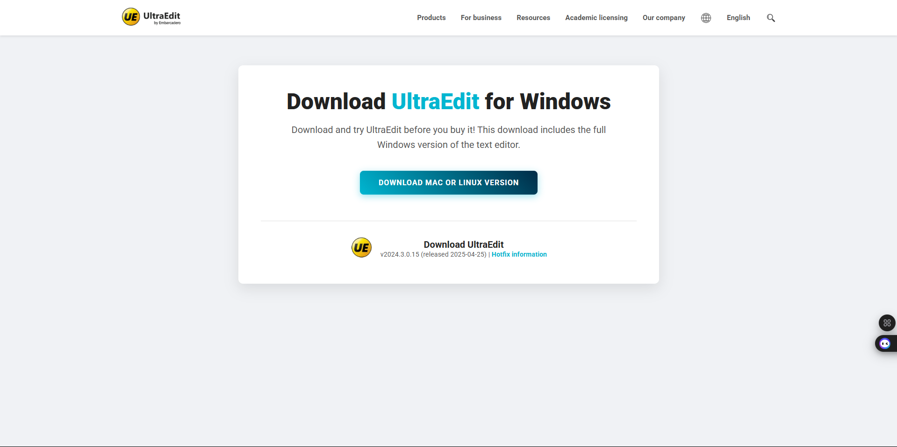

# Sigma Web Development - Exercise 6: Professional Download Page

This repository contains my solution for Exercise 6 of the Sigma Web Development course. The project is a complete, single-page layout for a software download page, built with modern HTML and CSS practices.

---

## 🚀 Project Features & Concepts

This project demonstrates the ability to build a clean, professional, and focused landing page from scratch.

- **Modern Layout:** The page uses a centered, card-based design with a sticky header for a clean user experience.
- **Advanced Flexbox:** Flexbox is used to create a responsive and perfectly aligned navigation bar and to structure the main content sections.
- **Cohesive Theming with CSS Variables:** The entire color scheme and theme are managed by CSS custom properties, making the design consistent and easy to modify.
- **Engaging Animations:**
    - **On-load animations** (`@keyframes`) for a smooth entry of content.
    - **Gradient Button with Hover Effects:** A primary call-to-action button with a gradient background and satisfying hover and active states.
- **Clean Code Practices:** All styles are organized in an external `style.css` file, and HTML is structured semantically.

## 🛠️ Tech Stack

- HTML5
- CSS3 (Flexbox, Animations, Custom Properties, Sticky Positioning)

## 🙏 Acknowledgements

- This project is part of the **Sigma Web Development Course** by **CodeWithHarry**.
